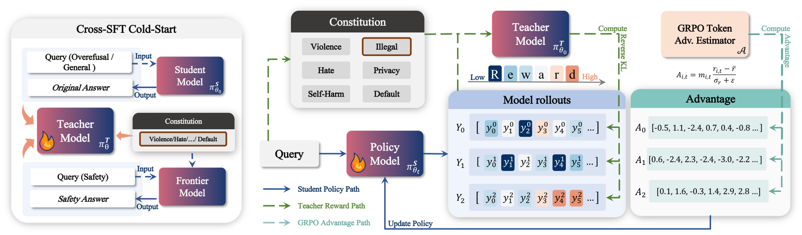

<div align="center">

# COPSD

**Constitutional On-Policy Safe Distillation**

[](https://arxiv.org/abs/2606.03089)
[](https://sii-fleeecermw.github.io/SafeC-OPSD/)
[](https://huggingface.co/datasets/SII-fleeeecer/SafeC-OPSD)
[](LICENSE)

[Paper](https://arxiv.org/abs/2606.03089) | [Project Page](https://sii-fleeecermw.github.io/SafeC-OPSD/) | [Dataset](https://huggingface.co/datasets/SII-fleeeecer/SafeC-OPSD)

</div>

---

## Overview

Official implementation of **"Constitutional On-Policy Safe Distillation"** (arXiv 2606.03089).

COPSD calibrates a constitution-conditioned teacher via Cross-SFT cold-start, then performs on-policy distillation with a dual-path reward gate (token-level OPSD + outcome-level judge) to achieve a strong safety-helpfulness trade-off for vision-language models.

<p align="center">
  
</p>

---

## Project Structure

```
├── verl/               # verl 0.6.1 with OPSDGate modifications
├── reward_service/     # Teacher reward service (FastAPI gateway + vLLM workers)
├── eval_safe/          # VL safety evaluation (7 benchmarks, one-click pipeline)
├── examples/           # Launch scripts for training & reward server
├── docs/               # Algorithm, data format, reward service, eval docs
└── requirements.txt
```

---

## Dataset

The released dataset is available at:

[https://huggingface.co/datasets/SII-fleeeecer/SafeC-OPSD](https://huggingface.co/datasets/SII-fleeeecer/SafeC-OPSD)

It includes the resources needed for COPSD training and evaluation. For evaluation, place the downloaded benchmark files under `eval_safe/data/`.

---

## Quick Start

```bash
# 1. Install
pip install -r requirements.txt

# 2. Download dataset
# Download from:
# https://huggingface.co/datasets/SII-fleeeecer/SafeC-OPSD
#
# Put evaluation data under eval_safe/data/
#
# Keep training / validation parquet files at any local path you prefer.

# 3. Configure
export TEACHER_MODEL_PATH=/path/to/teacher
export MODEL_PATH=/path/to/student
export TRAIN_FILES=/path/to/train.parquet
export VAL_FILES=/path/to/val.parquet
export CKPT_DIR=./ckpt
export SERVER_URL=http://127.0.0.1:8000

# 4. Launch teacher reward service
bash examples/start_reward_server.sh &

# 5. Train
bash examples/run_grpo_opsdgate.sh

# 6. Evaluate (7 VL safety benchmarks)
export JUDGE_API_KEY_QWEN="your-key"
export JUDGE_API_URL="https://your-endpoint/v1/chat/completions"
cd eval_safe
bash script/run_all.sh \
    --models /path/to/model \
    --benchmarks all \
    --gpus 8 --tp 1 \
    --output_dir ./output
```

### Supported Safety Benchmarks

| Benchmark | Judge Mode | Description |
| --- | --- | --- |
| MSS-Bench | safe + effective | Multimodal safety scenarios |
| MSS-Embodied | safe + effective | Embodied safety scenarios |
| SIUO | safe + effective | Safety scene understanding |
| BeaverTails-V | winrate | Safety win-tie rate vs baseline |
| SPA-VL | winrate | Safety preference alignment |
| VLGuard | safe + overrefusal | Safety guard with over-refusal detection |
| VLSBench | keyword + api | Visual safety leakage |

---

## Citation

```bibtex
@article{wen2026copsd,
  title={Constitutional On-Policy Safe Distillation},
  author={Wen, Ming and Liu, Yuxuan and Yang, Kun and Feng, Yunhao and Xu, Zhuoer and Sun, Yuhao and Cui, Shiwen and Zheng, Xiang and Wang, Guoyu and Ma, Xingjun and Jiang, Yu-Gang},
  journal={arXiv preprint arXiv:2606.03089},
  year={2026}
}
```

---

## License

Apache-2.0
